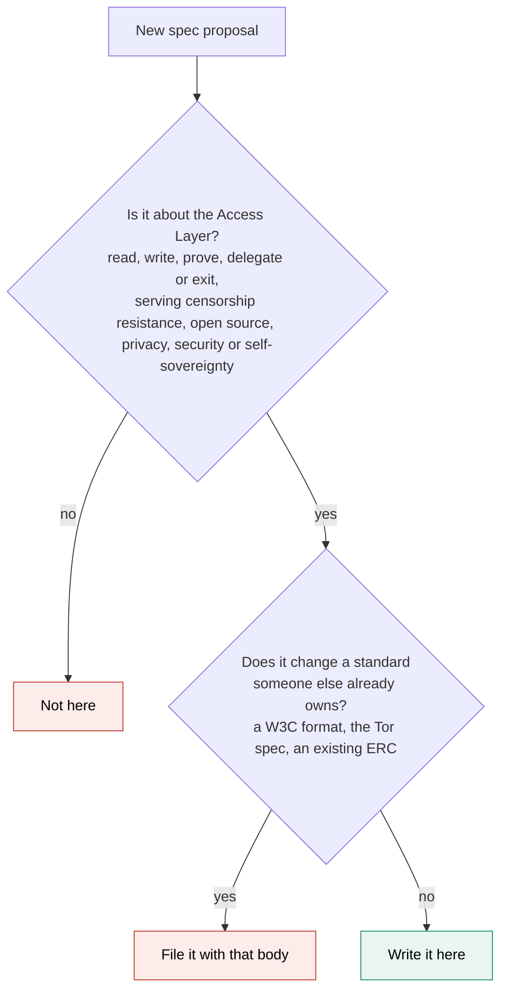

# Process

The rules for writing, reviewing and numbering specs here. EIP-1 does the same job for EIPs.

| Document | Covers |
|---|---|
| [lifecycle.md](lifecycle.md) | The stages a spec moves through and what each one promises |
| [front-matter.md](front-matter.md) | The metadata every spec carries, and the allowed values |
| [intake.md](intake.md) | How a new spec gets proposed, numbered and merged |
| [spec-template.md](spec-template.md) | The skeleton to copy when writing one |
| [governance.md](governance.md) | The CC0 licence, and where the approval rule lives |

## What belongs here

This repository holds specs for the Access Layer, meaning the paths through which people and their agents read from Ethereum, write to it, prove things about themselves, delegate authority, and exit when a provider fails. A spec belongs here when it strengthens at least one of the Access Layer guarantees, censorship resistance, open source, privacy, security or self-sovereignty.

It hosts two kinds of document of its own.

- Original specs, for work that has no standards home anywhere. A private-read protocol or a verifiable RPC receipt has no existing body to take it.
- Profiles, which say how existing standards work together for one use case. Each standard has its own home, W3C for credentials, the ERC process for wallets, but the combination has none, so it is written here.

Specs that live elsewhere get an entry here only when a spec here depends on them, or when their text started here and moved out. Anything else is a plain link in the prose of the spec that mentions it, see [front-matter.md](front-matter.md).

## What does not belong here

Changes to a standard someone else already owns. A change to the W3C credential format belongs in W3C, a change to anonymous routing belongs in the Tor spec process, and a change to an existing ERC belongs in the [ERC process](https://eips.ethereum.org/erc). A new spec that already needs every wallet or client to implement it also starts as an ERC.

This repository does not list tools, libraries or implementations, and does not link outward to them. Tools go stale and specs should not. A tool that implements a spec links to the spec, never the other way around.

## Where a new spec should go

This repository is the home for Access Layer specs. If a spec ever moves to another body later, it keeps its number and a pointer here, see [lifecycle.md](lifecycle.md).
