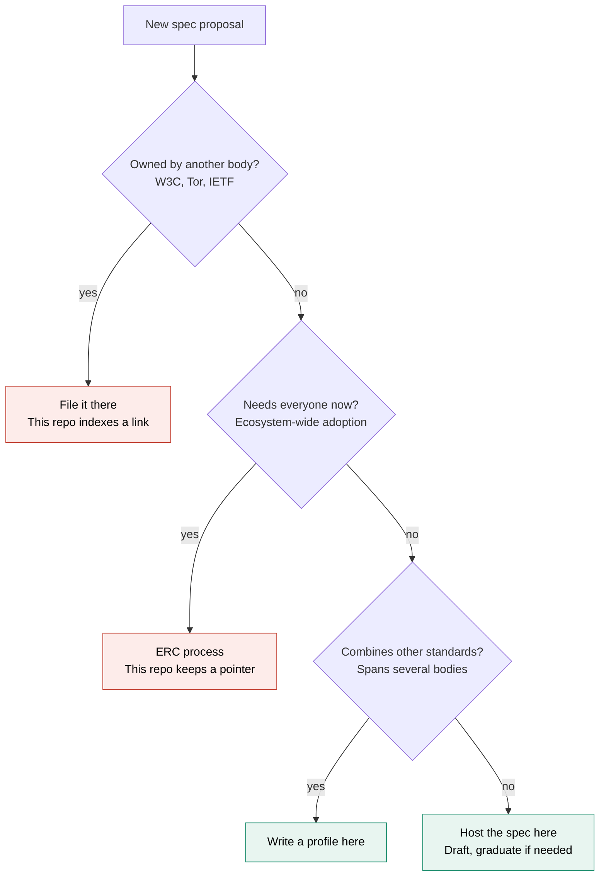

# Process

The rules for writing, reviewing and numbering specs here. EIP-1 does the same job for EIPs.

| Document | Covers |
|---|---|
| [lifecycle.md](lifecycle.md) | The stages a spec moves through and what each one promises |
| [front-matter.md](front-matter.md) | The metadata every spec carries, and the allowed values |
| [intake.md](intake.md) | How a new spec gets proposed, numbered and merged |
| [spec-template.md](spec-template.md) | The skeleton to copy when writing one |
| [governance.md](governance.md) | The CC0 licence, plus the approval rule still to settle |

## What belongs here

This repository holds specs for the Access Layer, meaning the paths through which people and their agents read from Ethereum, write to it, prove things about themselves, delegate authority, and exit when a provider fails.

It hosts two kinds of document of its own.

- Original specs, for work that has no standards home anywhere. A private-read protocol or a verifiable RPC receipt has no existing body to take it.
- Profiles, which say how existing external standards are combined for one use case. No single external body writes these, because they span several.

Everything else is an indexed link to a spec that lives elsewhere.

## What does not belong here

Work owned by another standards body goes to that body, and this repository indexes it. A change to the credential format itself belongs in W3C. A change to anonymous routing may belong in the Tor spec process. A proposal that genuinely needs every wallet or client to implement it belongs in the [EIP process](https://eips.ethereum.org).

This repository does not list tools, libraries or implementations, and does not link outward to them. Tools go stale and specs should not. A tool that implements a spec links to the spec, never the other way around.

## Where a new spec should go

The test in the second question is not whether something touches interoperability. It is whether it needs everyone to implement it yet. Work that is still taking shape can incubate here as a draft and graduate later.
